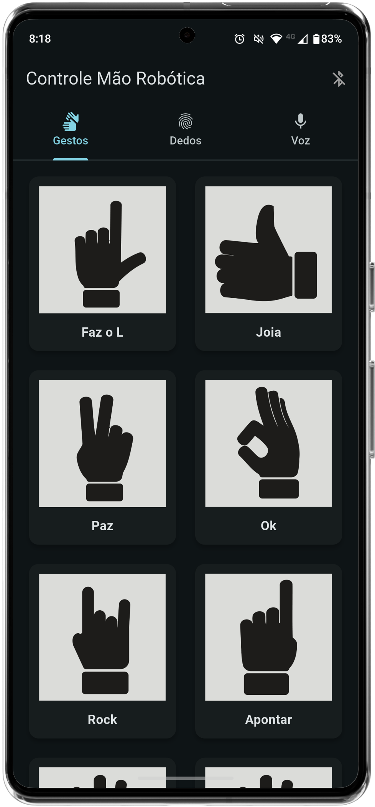

# Prótese de mão robótica - Aplicativo de controle

<p align="center">
  
</p>

Este repositório contém apenas o aplicativo móvel desenvolvido na disciplina Projeto Integrado de Computação II. O app controla a prótese de mão criada pelo grupo: comunica-se com um ESP32 que aciona 5 servomotores para tensionar e relaxar fios de pesca (produzindo a flexão dos dedos), enquanto elásticos promovem a extensão. A prótese possui independência de movimento entre os dedos e 3 graus de liberdade por dedo (flexão/extensão nas articulações metacarpofalângica, interfalângica proximal e interfalângica distal). Há também um sensor de pressão na palma para detectar quando a mão segura um objeto. Pelo aplicativo é possível executar gestos pré-definidos, criar gestos personalizados e usar comandos de voz para controlar a mão.

<div align="center">
  
  
  
</div>

## Como executar localmente (com Android Studio)

Requisitos básicos:

- Flutter SDK instalado e disponível no PATH
- Android Studio (com plugins Flutter e Dart)
- Android SDK configurado e um dispositivo/emulador disponível

Passos rápidos (Bash):

1. Clone o repositório e entre na pasta do projeto:

```bash
git clone https://github.com/jcquadros/app_protese_robotica_de_mao.git
cd app_protese_robotica_de_mao
```

2. Abra o projeto no Android Studio: escolha "Open" e selecione a pasta do projeto (`mao_robotica_app`).

3. No Android Studio, aguarde a sincronização. Se necessário, instale os plugins Flutter e Dart quando solicitado.

4. No terminal do Android Studio (ou em um terminal Bash), execute:

```bash
flutter pub get
```

5. Conecte um dispositivo Android com depuração USB habilitada ou inicie um emulador Android.

6. Execute o app pelo botão "Run" do Android Studio ou pelo terminal:

```bash
flutter run -d <device-id>
```

Observações:

- Se o Flutter não estiver no PATH, use o caminho completo para o executável do Flutter.
- Em caso de problemas com SDK/ndk, verifique as configurações do Android Studio em "SDK Manager".
- Este repositório contém apenas o aplicativo móvel; a comunicação com o firmware ESP32 exige que o hardware esteja ligado e configurado conforme o projeto.
